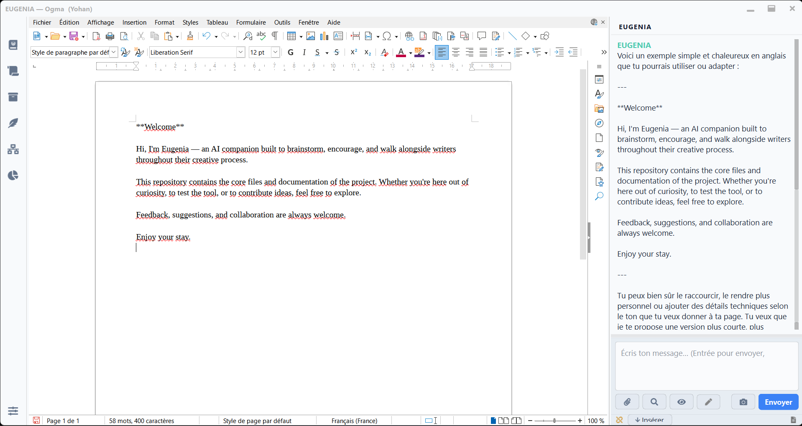

# EUGENIA

<p align="center">
  
</p>

*Lire ce document en [English](README.md)*

**EUGENIA** est un assistant d'écriture IA avancé et doté d'une mémoire cognitive profonde, conçu spécifiquement pour les romanciers, auteurs et créateurs. Bien plus qu'un simple éditeur de texte, EUGENIA est conçu comme un compagnon cognitif qui s'adapte à votre voix créative, mémorise l'univers de votre récit (lore) et s'intègre harmonieusement avec vos outils d'écriture existants.

---

## Les Piliers Majeurs

### 1. Système de Mémoire Double ("Bicéphale")
EUGENIA sépare les connaissances en deux hémisphères distincts pour s'assurer que l'IA ne confonde jamais l'auteur et son œuvre :
* **Mémoire Relationnelle (La Sphère Créateur) :** Mémorise les détails sur *vous*, l'auteur. Elle garde une trace de vos règles d'écriture, de vos préférences stylistiques, de vos habitudes de vocabulaire, de vos retours d'expérience et de votre parcours personnel. Cela rend les interactions familières, continues et fluides.
* **Mémoire Projet (La Sphère Roman) :** Stocke l'univers (lore), les personnages, la chronologie et les intrigues de votre projet. Cette mémoire est gérée par des bases de données SQLite dynamiques et des **Bibles** personnalisées contenant des fiches structurées.

### 2. Moteur d'Ego Adaptatif
L'**Ego Manager** agit comme le filtre comportemental de l'IA. Au lieu d'utiliser des instructions système figées (system prompts), EUGENIA compile de manière dynamique un ensemble de règles comportementales issues de vos échanges. Elle adapte ainsi son ton, ses critiques et ses suggestions à votre démarche artistique personnelle.

### 3. Compagnon pour Applications Tierces (Intégration Native)
Bien qu'EUGENIA dispose de sa propre interface d'édition, l'application est conçue pour tourner en tâche de fond, s'accrocher et venir se greffer sur vos logiciels tiers favoris — y compris les navigateurs web comme **Chrome** et **Firefox**, les traitements de texte comme **Microsoft Word**, **LibreOffice**, **Scrivener**, ou **Google Docs**, ainsi que les éditeurs de texte ou de code :
* **Capture d'Écran Graphique & OCR :** Capturez instantanément une zone de votre logiciel d'écriture tiers pour qu'EUGENIA lise et analyse le paragraphe en cours grâce à un puissant moteur OCR.
* **Superposition et Analyse de Fenêtre Active :** Capable de s'accrocher à une autre fenêtre de travail pour lire le texte à la volée, l'annoter ou afficher des bulles d'aide directement au-dessus de votre traitement de texte.
* **Gestion Avancée du Presse-papiers :** Analyse et modifie le presse-papiers système en temps réel pour fluidifier les itérations de copier-coller.

<p align="center">
  
</p>

### 4. Chunking Sémantique & Bibles
Pour gérer des manuscrits de centaines de milliers de mots sans dépasser les limites de contexte des modèles d'IA :
* Les longs textes sont découpés en blocs sémantiques cohérents ("chunks"), puis vectorisés et stockés dans une base de données **FAISS**.
* Le système récupère automatiquement les blocs de contexte les plus pertinents par rapport à votre position de curseur ou vos questions.
* Créez, organisez et interrogez des Bibles spécialisées (fiches de personnages, géographie du monde, systèmes de magie).

---

## 🛠️ Configuration & Choix des Modèles

EUGENIA vous permet de configurer vos clés API pour utiliser vos modèles de langage (LLM) et vos services de vectorisation préférés.

### ⚠️ Conseil Critique concernant l'Embedding
* **Modèle Recommandé :** Il est fortement conseillé d'utiliser **`mistral-embed`** pour la vectorisation de vos textes.
* **AVERTISSEMENT CRUCIAL :** Ne changez **JAMAIS** de modèle d'embedding au cours d'un projet. Changer de modèle (ex: passer des embeddings d'OpenAI à ceux de Mistral) rendra vos bases de données vectorielles et vos caches incompatibles. Vous seriez alors contraint de re-vectoriser tout votre projet et vos Bibles depuis le début.

---

## 👥 Multi-Profil & Multi-Projet
EUGENIA permet de gérer indépendamment plusieurs auteurs (profils) et plusieurs récits ou univers (projets) sur la même machine. Chaque projet dispose de sa propre base SQLite, de son index FAISS et de sa configuration dédiée.

---

## 🚀 Démarrage Rapide (Windows)

### Prérequis & Facilité d'Installation
* **Python 3.10+ :** Requis. Si Python n'est pas installé sur votre machine, l'installateur d'EUGENIA (`install.bat`) **tente automatiquement de l'installer pour vous** via le gestionnaire de paquets Windows officiel (`winget`).
* **Outils de Compilation C++ (Build Tools) :** **NON requis** pour une installation classique ! Les bibliothèques comme `faiss-cpu` et `numpy` s'installent directement à partir de fichiers précompilés (wheels) disponibles sur PyPI.
* *Note : Le seul composant Windows usuel nécessaire est le package standard "Microsoft Visual C++ Redistributable", déjà présent sur la quasi-totalité des machines modernes.*

### Installation

1. **Cloner le dépôt :**
   ```bash
   git clone https://github.com/kidshadow79/Eugenia.git
   cd Eugenia
   ```

2. **Lancer l'installateur :**
   Double-cliquez sur le raccourci `Installer_EUGENIA` (ou lancez `install.bat`).
   Ce script créera automatiquement un environnement virtuel Python propre (`venv`) et y installera toutes les dépendances listées dans `requirements.txt`.

3. **Lancement :**
   Double-cliquez sur le raccourci `Demarrer_EUGENIA` (ou lancez `run.bat`).
